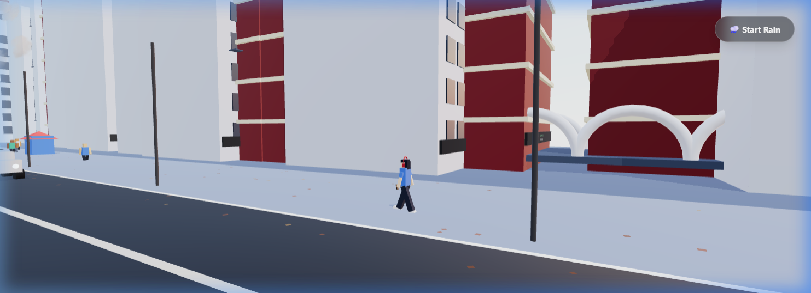

# 🌊 Murshid R | Immersive 3D Portfolio

An advanced, cinematic 3D portfolio experience showcasing the intersection of Data Science, AI, and Aerospace technology. Inspired by the vibrant energy of Chennai and the iconic Marina Beach.



## 🎓 Identity: Student & AI Enthusiast
This portfolio reflects my journey as a **B.Tech CSE (Data Science & AI)** student, focusing on translating complex research into production-grade systems. From real-time telemetry dashboards to deep learning for rocket propulsion, this is a hub for my technical experiments.

## 🚀 Key Projects
- **Smart Attendance System**: A robust desktop application for staff management using Python, CustomTkinter, and SQLite.
- **Enterprise Data Automation Pipeline**: A "Self-Service" analytical pipeline transforming raw data into interactive insights using Pandas and Streamlit.
- **Combustion Instability Prediction**: Deep Learning research using TCNs for real-time aerospace stability analysis.
- **Ground Station Dashboard**: High-frequency telemetry dashboard for rocket sensor data processing.

## 🛠️ Performance & Tech Stack
Built for the modern web with a focus on high-DPI awareness and mobile performance.
- **Engine**: Three.js, React Three Fiber, GSAP
- **UI Architecture**: TailwindCSS, Framer Motion, Lucide React
- **Optimizations**: Adaptive quality tiers for mobile/desktop, dynamic resolution scaling, and entity culling.

## 💻 Running Locally
1. **Clone & Install**:
   ```bash
   npm install --legacy-peer-deps
   ```
2. **Configure Environment**: Add your `GEMINI_API_KEY` to the `.env` file.
3. **Launch**:
   ```bash
   npm run dev
   ```

## 📄 License & Credits
Developed by **Murshid R**. MIT License. Experience the cinematic journey at [http://murshid-r.vercel.app](http://murshid-r.vercel.app).

